# Thailand Election Data Preparation (2023)

> 📊 Google Colab notebook for preparing, exploring, and cleaning Thailand 2023 election data.  
> โปรเจกต์โชว์ตัวอย่างงาน Data Wrangling และ EDA สำหรับพอร์ต Data Analyst

---

## 📌 Motivation

ชุดข้อมูลผลการเลือกตั้งไทย 2566 มีหลายไฟล์/หลายชีท (Excel, CSV)  
✅ เป้าหมายคือรวม → ทำความสะอาด → แปลงให้อยู่ใน *tidy data* และใช้สำหรับสร้าง Dashboard/Analysis

---

## 🎯 Goals

- Import & explore raw election data
- Clean & check missing values
- Normalize into tidy format
- Merge data sources into a single table
- Export cleaned CSV

## 💻 Tech Stack

- Google Colab
- Python 3.x
- pandas
- numpy

---

## 📑 Notebook Workflow

### 1️⃣ Mount Google Drive
เข้าถึงไฟล์ใน Google Drive:
```python
from google.colab import drive
drive.mount('/content/gdrive')
```
### 2️⃣ Import Data
โหลดไฟล์ Excel
แยกหลายชีทเป็น DataFrame
```python
import pandas as pd
dfs = pd.ExcelFile('ectreport2023.xlsx')
dfs.sheet_names
```
### 3️⃣ Explore Database
- ดู Schema, ตรวจสอบ Columns, Types
- ตรวจสอบ Nulls
- Clean / fillna
- Map รหัส/ชื่อพรรค/โค้ด/สี
---
✅ ดู Schema, ตรวจสอบ Columns, Types ตัวแปรใน sheet อื่นๆ
---
```python
Schema.head()  
```
---

---
✅ ตรวจสอบ Nulls
---
```python
print(result_constituencies_PartyList.isnull().any()) # เช็คค่าว่าง Null
result_constituencies_PartyList.head() 
```
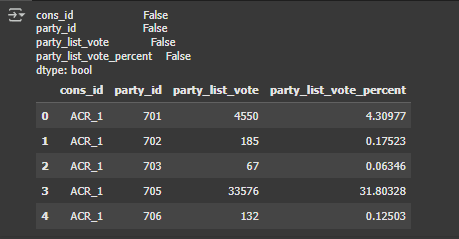
```python
print(result_constituencies_Candidate.isnull().any()) # เช็คค่าว่าง Null
result_constituencies_Candidate.head()
```
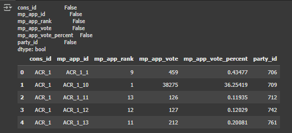
```python
print(result_constituencies_status.isnull().any()) # เช็คค่าว่าง Null
result_constituencies_status.head()
```
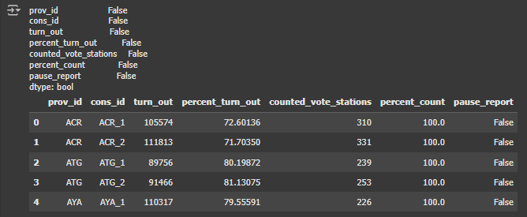
```python
print(info_province.isnull().any()) # เช็คค่าว่าง Null
info_province.head()
```
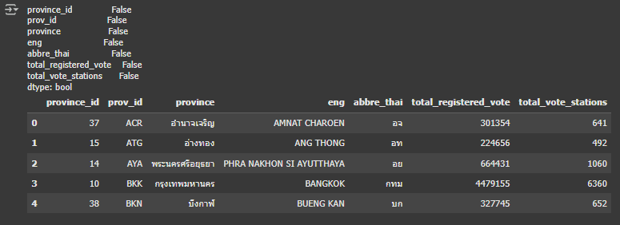
```python
print(Candidate_constituency.isnull().any()) # เช็คค่าว่าง Null
Candidate_constituency.head()
```
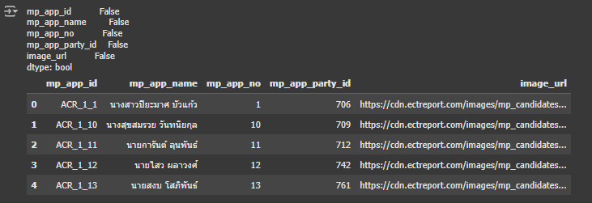
```python
print(Candidate_partyList.isnull().any()) # เช็คค่าว่าง Null
Candidate_partyList.head()
```
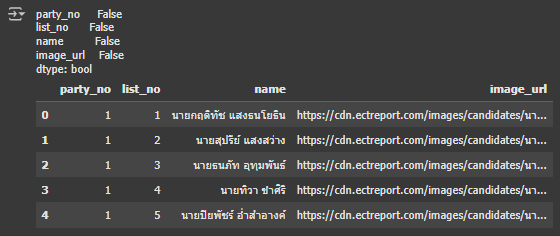
```python
print(Candidate_pm.isnull().any()) # เช็คค่าว่าง Null
Candidate_pm.head()
```
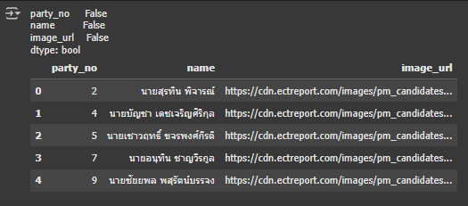

---
✅ กรณีมีค่า null จะทำการ Clean / fillna
---
```python
print(info_party_overview.isnull().any()) # เช็คค่าว่าง Null
info_party_overview.head()
```
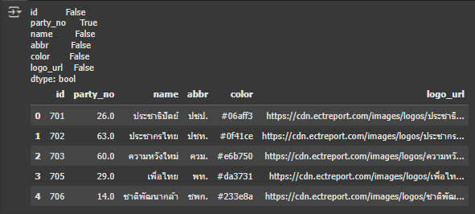

จะเห็นได้ว่า party_no  เป็น True แสดงว่ามีค่าว่างโดยจะทำการเรียกออกมาดูว่าชื่ออะไรที่ว่าง
```python
info_party_overview[info_party_overview['party_no'].isnull()] #แสดง row ที่มี party_no ว่าง
# party_no คือ เลขพรรคการเมืองในบัตรเลือกตั้ง ส.ส. บัญชีรายชื่อ
# ประชาสามัคคี	- 99
# พลังบูรพา - 99
# รักษ์ธรรม - 99
```
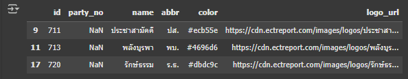

โดยจะทำการเติมค่าว่าด้วย 99
```python
# แทนค่าว่างด้วยหมายเลข 99
info_party_overview['party_no'] = info_party_overview['party_no'].fillna(99)
```

จากนั้นเรียกมาดูเพื่อเช็คอีกรอบ
```python
print(info_party_overview.isnull().any()) # เช็คค่าว่าง Null อีกรอบ
info_party_overview.head()
```
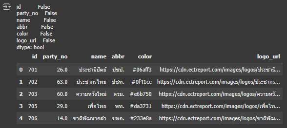

จะเห็นได้ว่า party_no  เป็น false แล้วแสดงว่าไม่มีค่าว่าง

---
- ✅ Map รหัส/ชื่อพรรค/โค้ด/สี เพื่อเตียมข้อมูลไปใช้ในการทำ visualization
---
```python
# เชื่อมตารางเพื่อ keep ข้อมูลชื่อ สส และ ชื่อ พรรคที่สังกัด
result_constituencies_Candidate['mp_app_name'] = result_constituencies_Candidate['mp_app_id'].map(Candidate_constituency.set_index('mp_app_id')['mp_app_name'])
result_constituencies_Candidate['party_name'] = result_constituencies_Candidate['party_id'].map(info_party_overview.set_index('id')['name'])
```
ตัวอย่างการรวมตารางเพื่อไปใช้ในการทำ visualization
```python
# ตารางจังหวัด (1)
info_province.head(3)
```
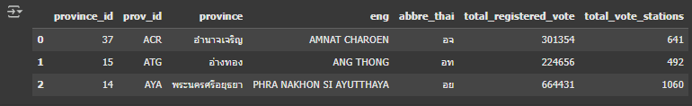
```python
# ตารางเขตเลือกตั้ง (2)
info_constituency.head(3)
```
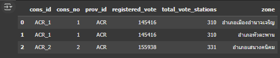
```python
# (3) x (6)
table_merge = result_constituencies_Candidate.merge(Candidate_constituency, how ='left', left_on='mp_app_id',right_on='mp_app_id')
print(table_merge.shape)
table_merge.head()
```
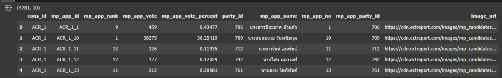
```python
cons_id = table_merge3['cons_id'].tolist()
cons_no = []
for i in range(len(cons_id)):
  re = cons_id[i].split('_')[-1]
  cons_no.append(re)
table_merge3['cons_no'] = cons_no
table_merge3.head(-10)
```
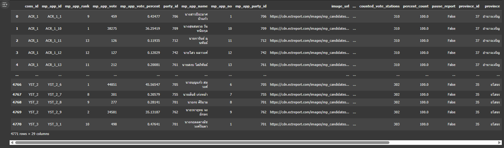

### 4️⃣ Export
บันทึกเป็นไฟล์ CSV พร้อมใช้
```python
table_merge.to_csv('table_merge_result.csv', index=False)
```
### 5️⃣ Dashboard Preview
ตัวอย่าง **Dashboard** จาก Google Looker Studio  
สรุป **ผลการเลือกตั้ง 2566 ของไทย** พร้อมภาพ Visualization:

- ผู้ใช้สิทธิเลือกตั้งทั้งหมด
- เปอร์เซ็นต์การใช้สิทธิ
- ผลคะแนนพรรคการเมืองสำคัญ
- แผนที่แสดงการกระจายของผู้สมัครและผลคะแนน
- ตารางอันดับผู้สมัครที่ได้คะแนนสูงสุด

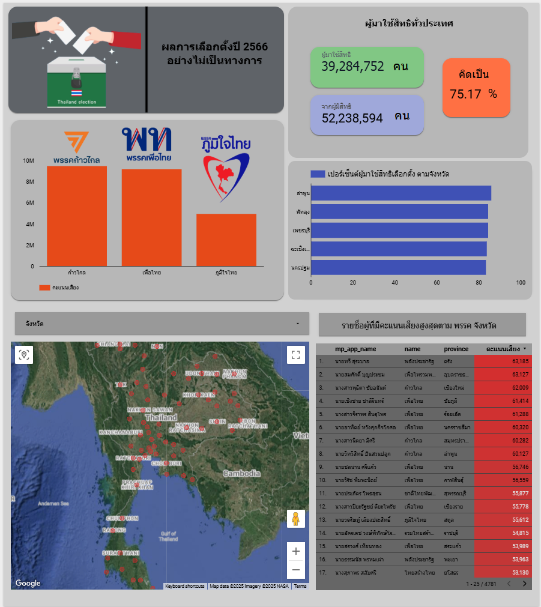(https://lookerstudio.google.com/reporting/bb4dba67-182b-4a2c-a8db-55a1f2cac7a7)
